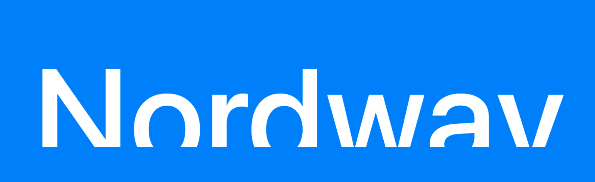

# Nordway Bank

Nordway Bank is a test project designed to practice and improve PHP and SQL skills. The project is still under development, but it already includes a partially functioning sign-up and login system. Future updates may include features like balance display, money withdrawal, and depositing functionality.

## Features
- **Sign-Up and Login:** Basic user authentication system.
- **Forgot Password:** A system to reset forgotten passwords (in progress).
- **Main Page:** Placeholder for future features such as:
  - Displaying user balance.
  - Withdrawing money.
  - Depositing money.

## Requirements
- **XAMPP:** The project runs on a local PHP and MySQL environment.
- **phpMyAdmin:** Used to manage the SQL database.

## Installation
1. Clone or download the repository to your local machine.
2. Set up XAMPP and ensure Apache and MySQL are running.
3. Open `phpMyAdmin` and import the provided database file located in the source files of the project.
4. Place the project files in the `htdocs` directory of XAMPP.
5. Access the project in your browser via `http://localhost/your-project-directory`.

## Usage
1. **Sign-Up:** Create an account using the sign-up page.
2. **Log In:** Use your credentials to log in.
3. **Future Features:** The main page will include balance display, withdrawal, and deposit options.

## Technologies Used
- **PHP**: For backend logic.
- **SQL**: For database management.
- **phpMyAdmin**: For database interaction.

## Contribution
Originally maintained by me and my friend [stinkyrat612](https://github.com/stinkyrat612), the project is now solely maintained by me. Contributions are welcome! Feel free to fork the repository and submit pull requests.

## License
This project is for educational purposes and is not licensed for production use.

## Author
Maintained by pigluz.

